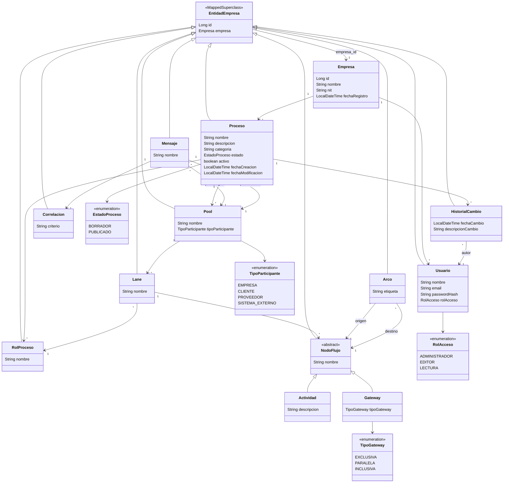

# Diagrama de clases — modelo de dominio

Generado a partir de las 13 entidades JPA en `src/main/java/com/facimus/procesos/`.

## Notas de lectura

- `EntidadEmpresa` no es una entidad propia: es un `@MappedSuperclass` que
  aporta `id` y `empresa` a todas las tablas excepto `Empresa`. Ver
  [ADR-002](../adr/ADR-002-multitenencia-empresa-id.md).
- `NodoFlujo` es `@Inheritance(SINGLE_TABLE)`: `Actividad` y `Gateway` viven
  en la misma tabla `nodo_flujo`, discriminadas por `tipo_nodo`. Así `Arco` y
  `Lane` apuntan a "cualquier nodo" con una sola FK.
- El cruce real entre los paquetes `modelado` y `gestion` es
  `Lane -> RolProceso` (el rol se asigna a nivel de lane, no de actividad).
