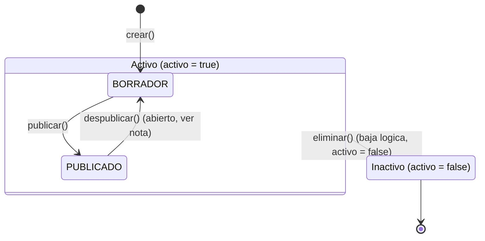

# Diagrama de estados — `Proceso`

`Proceso` tiene dos dimensiones de estado independientes (ver
[modelo-datos.md](../modelo-datos.md)):

- `estado` (`EstadoProceso`): `BORRADOR` / `PUBLICADO` — ciclo de vida
  editorial del contenido.
- `activo` (`boolean`): eliminación lógica, ortogonal al `estado` — un
  proceso puede borrarse lógicamente estando en cualquiera de los dos
  estados editoriales, y nunca se borra físicamente.

## Notas de diseño

- **`eliminar()` nunca es un `DELETE` físico** (ya fijado en las decisiones
  de arquitectura): pone `activo = false` sin importar si el proceso estaba
  en `BORRADOR` o `PUBLICADO`.
- **`despublicar()` (PUBLICADO → BORRADOR) queda abierto**: el enunciado no
  lo pide explícitamente. Se incluye en el diagrama porque es la transición
  simétrica natural y probablemente se necesite para permitir editar un
  proceso publicado sin perder su registro de publicación anterior, pero no
  se implementa sin decidirlo explícitamente — no asumir que existe hasta
  que un ADR o el enunciado lo confirme.
- **No hay transición de reactivación** (`Inactivo → Activo`): con la
  información actual, un proceso eliminado lógicamente se queda así. Si se
  necesita reactivar, es una decisión nueva, no asumida aquí.
- Cada transición (`crear`, `editar`, `publicar`, `eliminar`) registra un
  `HistorialCambio` — ver
  [diseno-servicios-gestion.md](../diseno-servicios-gestion.md#procesoservice).
