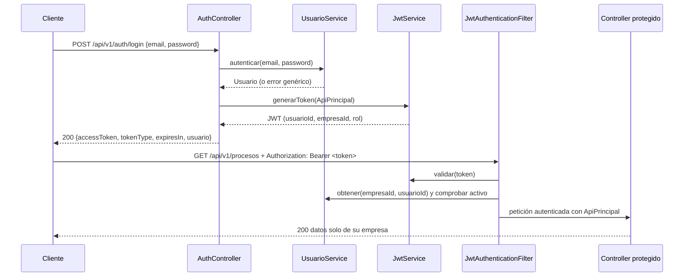

# Seguridad: autenticación JWT y matriz de permisos

Decisión de fondo: [ADR-004](adr/ADR-004-migracion-rest-jwt.md).
Código: paquete `com.facimus.procesos.security`.

## Flujo de autenticación

## Componentes

| Clase | Responsabilidad |
|---|---|
| `JwtService` | Genera y valida el token (HS256). Claims: `sub` (email), `usuarioId`, `empresaId`, `rol`. |
| `JwtAuthenticationFilter` | Lee `Authorization: Bearer`, valida el token y comprueba que el usuario siga activo. |
| `ApiPrincipal` | Identidad autenticada: `usuarioId`, `empresaId`, `email`, `rol`. Los controllers la reciben con `@AuthenticationPrincipal`. |
| `SecurityConfig` | Sesión stateless, CSRF desactivado y matriz de permisos. |
| `JwtAuthEntryPoint` | Responde `401` en formato `ProblemDetail`. |
| `JwtAccessDeniedHandler` | Responde `403` en formato `ProblemDetail`. |
| `CorsConfig` | Orígenes permitidos (`CORS_ALLOWED_ORIGINS`, por defecto `http://localhost:4200`). |

## Reglas del login (HU-03)

- La contraseña se guarda con BCrypt; nunca en texto plano.
- Si el correo no existe o la contraseña no coincide, la respuesta es la
  misma (`401` con mensaje genérico). Así no se revela qué correos existen.
- Un usuario desactivado no puede iniciar sesión, y su token deja de
  funcionar en la siguiente petición.

## Matriz de permisos

Spring evalúa las reglas en orden y aplica la primera que coincide.

| # | Petición | Quién puede |
|---|---|---|
| 1 | `POST /api/v1/auth/login`, `POST /api/v1/empresas` | Público |
| 2 | Swagger (`/swagger-ui/**`, `/v3/api-docs/**`), `/h2-console/**` | Público |
| 3 | `POST /api/v1/auth/logout` | Cualquier usuario autenticado |
| 4 | Cualquier método en `/api/v1/usuarios/**` | `ADMINISTRADOR` |
| 5 | Cualquier `GET` en `/api/v1/**` | Cualquier usuario autenticado |
| 6 | Escritura en `/api/v1/roles/**` | `ADMINISTRADOR` |
| 7 | `DELETE` en procesos, actividades, arcos, gateways, pools, lanes y mensajes | `ADMINISTRADOR` |
| 8 | Cualquier otra escritura en `/api/v1/**` | `ADMINISTRADOR` o `EDITOR` |

Resumen por rol:

| Acción | `ADMINISTRADOR` | `EDITOR` | `SOLO_LECTURA` |
|---|---|---|---|
| Consultar | Sí | Sí | Sí |
| Crear y editar procesos y diagramas | Sí | Sí | No |
| Eliminar | Sí | No | No |
| Gestionar usuarios y roles de proceso | Sí | No | No |

La matriz está probada en `security/AutorizacionPorRolTest`.

## Aislamiento entre empresas

- El `empresaId` se toma siempre del token, nunca del cliente.
- Todos los repositorios filtran por `empresaId` (ADR-002).
- Un recurso de otra empresa responde `404`, igual que uno inexistente.
- Lo prueban `security/AislamientoEmpresasIntegracionTest` y
  `arquitectura/AislamientoTenantTest` (ArchUnit).

## Pendientes

- **Correo duplicado entre empresas.** La restricción única es
  `(empresa_id, email)`, pero el login busca solo por email. Si dos empresas
  registran el mismo correo, el login de ambos usuarios falla con `500`. Hay
  que validar el correo de forma global al registrar la empresa y al crear
  usuarios.
- Los permisos son globales por rol de acceso. No se pueden limitar a un pool
  o proceso concreto (HU-24).