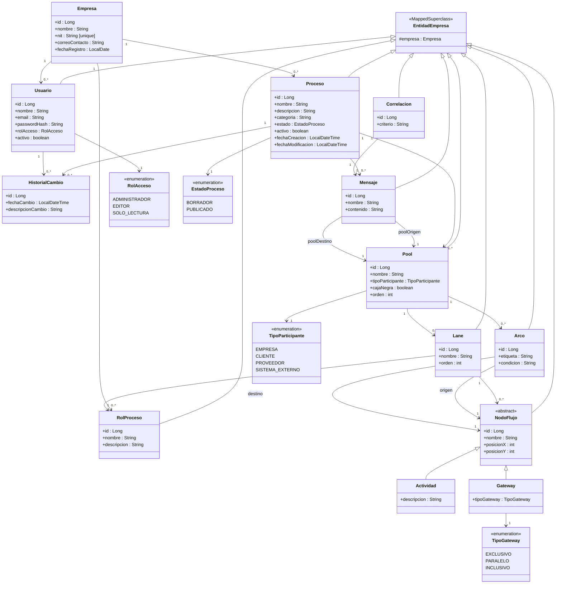
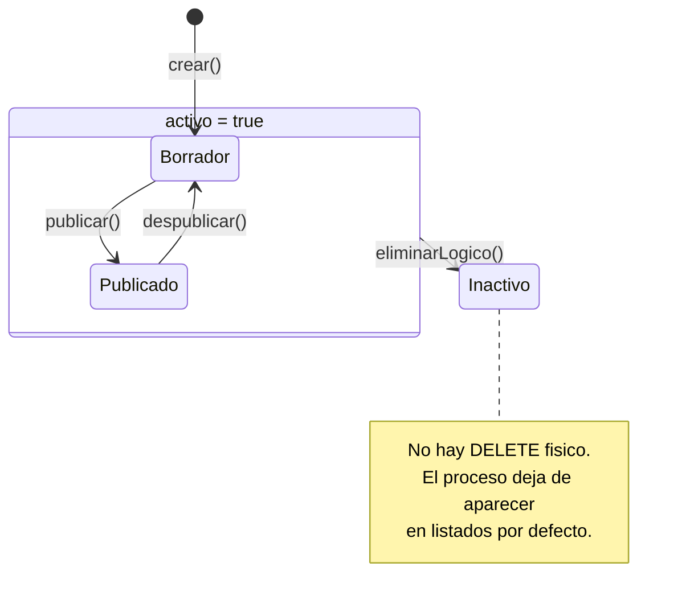

# Modelo de datos — 13 entidades

## Diagrama de clases

## Bloque gestion (5 entidades)

### Empresa

| Campo | Tipo | Restriccion |
|-------|------|-------------|
| id | Long | @Id, IDENTITY |
| nombre | String | obligatorio |
| nit | String | obligatorio, unico global |
| correoContacto | String | obligatorio |
| fechaRegistro | LocalDate | asignado al crear |

No hereda de `EntidadEmpresa` (es la raiz de tenencia).

### Usuario

| Campo | Tipo | Restriccion |
|-------|------|-------------|
| id | Long | @Id, IDENTITY |
| nombre | String | obligatorio |
| email | String | obligatorio, unico por empresa |
| passwordHash | String | obligatorio, cifrado |
| rolAcceso | RolAcceso | enum STRING |
| activo | boolean | default true |
| empresa | Empresa | @ManyToOne, obligatorio |

### Proceso

| Campo | Tipo | Restriccion |
|-------|------|-------------|
| id | Long | @Id, IDENTITY |
| nombre | String | obligatorio, unico por empresa |
| descripcion | String | obligatorio |
| categoria | String | obligatorio |
| estado | EstadoProceso | enum STRING, default BORRADOR |
| activo | boolean | default true (eliminacion logica) |
| fechaCreacion | LocalDateTime | asignado al crear |
| fechaModificacion | LocalDateTime | actualizado en cada cambio |
| empresa | Empresa | @ManyToOne, obligatorio |

### HistorialCambio

| Campo | Tipo | Restriccion |
|-------|------|-------------|
| id | Long | @Id, IDENTITY |
| proceso | Proceso | @ManyToOne, obligatorio |
| autor | Usuario | @ManyToOne, obligatorio |
| fechaCambio | LocalDateTime | asignado al crear |
| descripcionCambio | String | obligatorio |

Solo INSERT, nunca se edita ni elimina.

### RolProceso

| Campo | Tipo | Restriccion |
|-------|------|-------------|
| id | Long | @Id, IDENTITY |
| nombre | String | obligatorio, unico por empresa |
| descripcion | String | opcional |
| empresa | Empresa | @ManyToOne, obligatorio |

## Bloque modelado (8 entidades)

### Pool

| Campo | Tipo | Restriccion |
|-------|------|-------------|
| id | Long | @Id, IDENTITY |
| nombre | String | obligatorio |
| tipoParticipante | TipoParticipante | enum STRING |
| cajaNegra | boolean | default false |
| orden | int | para ordenar en el diagrama |
| proceso | Proceso | @ManyToOne, obligatorio |
| empresa | Empresa | @ManyToOne, obligatorio |

### Lane

| Campo | Tipo | Restriccion |
|-------|------|-------------|
| id | Long | @Id, IDENTITY |
| nombre | String | obligatorio |
| orden | int | para ordenar en el pool |
| pool | Pool | @ManyToOne, obligatorio |
| rolProceso | RolProceso | @ManyToOne, obligatorio |
| empresa | Empresa | @ManyToOne, obligatorio |

### NodoFlujo (abstracta)

| Campo | Tipo | Restriccion |
|-------|------|-------------|
| id | Long | @Id, IDENTITY |
| nombre | String | obligatorio, unico por proceso |
| posicionX | int | coordenada X en el diagrama |
| posicionY | int | coordenada Y en el diagrama |
| lane | Lane | @ManyToOne, obligatorio |
| empresa | Empresa | @ManyToOne, obligatorio |

`@Inheritance(SINGLE_TABLE)`, discriminador `tipo_nodo`.

### Actividad (extiende NodoFlujo)

| Campo | Tipo | Restriccion |
|-------|------|-------------|
| descripcion | String | opcional |

### Gateway (extiende NodoFlujo)

| Campo | Tipo | Restriccion |
|-------|------|-------------|
| tipoGateway | TipoGateway | enum STRING, obligatorio |

### Arco

| Campo | Tipo | Restriccion |
|-------|------|-------------|
| id | Long | @Id, IDENTITY |
| etiqueta | String | opcional |
| condicion | String | obligatorio si gateway exclusivo/inclusivo |
| origen | NodoFlujo | @ManyToOne, obligatorio |
| destino | NodoFlujo | @ManyToOne, obligatorio |
| pool | Pool | @ManyToOne (redundante para validar mismo pool) |
| empresa | Empresa | @ManyToOne, obligatorio |

### Mensaje

| Campo | Tipo | Restriccion |
|-------|------|-------------|
| id | Long | @Id, IDENTITY |
| nombre | String | obligatorio |
| contenido | String | descripcion de los datos enviados |
| poolOrigen | Pool | @ManyToOne, obligatorio |
| poolDestino | Pool | @ManyToOne, obligatorio, distinto de poolOrigen |
| proceso | Proceso | @ManyToOne, obligatorio |
| empresa | Empresa | @ManyToOne, obligatorio |

### Correlacion

| Campo | Tipo | Restriccion |
|-------|------|-------------|
| id | Long | @Id, IDENTITY |
| criterio | String | obligatorio (ej: "numero de radicado") |
| mensaje | Mensaje | @OneToOne, obligatorio |
| empresa | Empresa | @ManyToOne, obligatorio |

## Reglas de dominio

Estas reglas se validan en la capa de servicio antes de persistir.

1. El NIT de Empresa es unico globalmente.
2. El email de Usuario es unico dentro de su empresa.
3. El nombre de Proceso es unico dentro de su empresa.
4. El nombre de RolProceso es unico dentro de su empresa.
5. El nombre de Actividad (NodoFlujo) es unico dentro del proceso.
6. Cada Actividad pertenece a exactamente una Lane.
7. Un Arco no puede tener el mismo nodo como origen y destino.
8. Origen y destino de un Arco deben pertenecer al mismo Pool.
9. No pueden existir dos arcos identicos para el mismo par origen-destino.
10. Gateways exclusivos e inclusivos requieren condicion en sus arcos salientes.
11. Un gateway divergente debe tener al menos dos arcos salientes.
12. Un Mensaje debe conectar pools diferentes.
13. Un RolProceso no se puede eliminar si alguna Lane lo usa.
14. Una Lane no se puede eliminar si contiene actividades.
15. La eliminacion de Proceso es logica (campo activo = false).
16. Cada cambio significativo se registra en HistorialCambio.

## Diagrama de estados de Proceso

