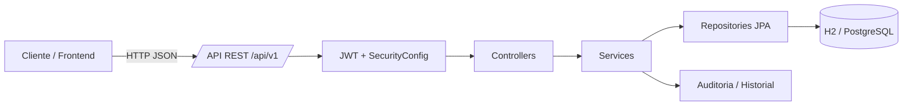
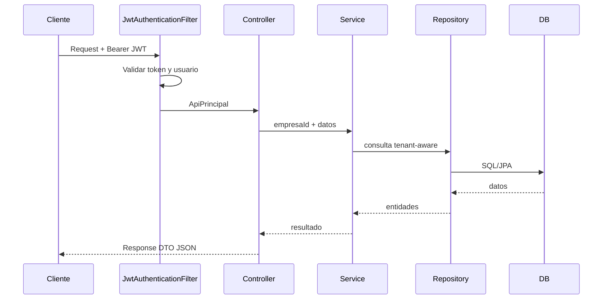

# Arquitectura visual de Beta

## Vista general

## Capas

- **Security** valida JWT, usuario activo, tenant y rol.
- **Controller** recibe HTTP/JSON y devuelve DTOs.
- **Service** aplica reglas de negocio y transacciones.
- **Repository** encapsula consultas Spring Data JPA.
- **Model** representa gestión empresarial y BPMN.

## Flujo autenticado

## Módulos principales

- `common/`: excepciones, entidad tenant y paginación.
- `config/`: OpenAPI e inicialización.
- `security/`: JWT, CORS y autorización.
- `gestion/`: empresas, usuarios, procesos, roles e historial.
- `modelado/`: pools, lanes, nodos, arcos y mensajes.
