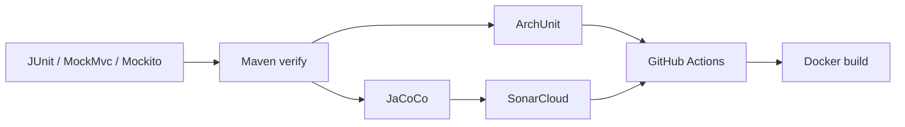

# Pruebas y calidad

## Flujo de validación



## Pruebas

- Services: JUnit 5 + Mockito.
- Controllers: MockMvc + Spring Security Test.
- Arquitectura: ArchUnit.
- Integración/build: Maven `verify`.

## Cobertura

JaCoCo genera el reporte usado por SonarCloud. La regla de trabajo del equipo es mantener **Coverage on New Code por encima del 80%** y cubrir comportamiento real, no getters artificiales.

## GitHub Actions

El workflow `.github/workflows/ci.yml` ejecuta:

1. Build & Test en Ubuntu.
2. Build & Test en Windows.
3. Reporte JaCoCo.
4. Reglas ArchUnit.
5. Build y arranque de imagen Docker.
6. SonarCloud en eventos `push`.

## SonarCloud

Configuración Maven:

- organization: `facimus-curiositatem`
- projectKey: `Facimus-Curiositatem_Beta-back`
- coverage plugin: JaCoCo

## Validación local

```bash
./mvnw clean verify
git status
git diff main...HEAD
```
