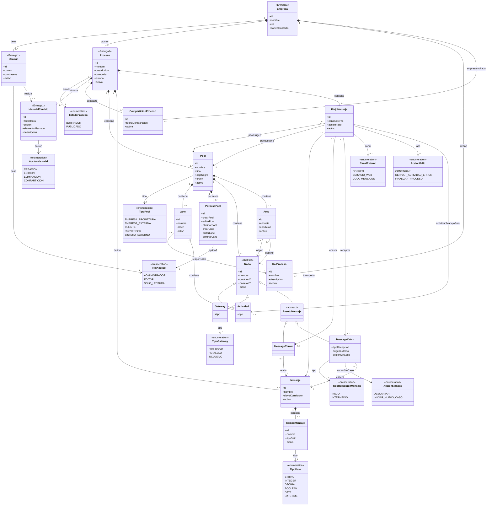

# Propuesta aprobada — Modelo de dominio

## Objetivo

Este documento consolida la versión aprobada del diagrama de clases del proyecto de Desarrollo Web.

El modelo representa el dominio completo del sistema y marca con `<<Entrega1>>` las clases que forman parte del primer alcance de implementación.

## Diagrama de clases

## Reglas de dominio principales

1. El NIT de `Empresa` es único globalmente.
2. El correo de `Usuario` es único globalmente.
3. El nombre de `Proceso` es único dentro de su empresa.
4. El nombre de `RolProceso` es único dentro de su empresa.
5. El nombre de `Actividad` es único dentro del proceso.
6. Cada `Actividad` pertenece exactamente a una `Lane`.
7. El `Pool` de una actividad debe coincidir con el `Pool` de su `Lane`.
8. Un `Arco` no puede tener el mismo nodo como origen y destino.
9. El `Arco`, su nodo origen y su nodo destino deben pertenecer al mismo `Pool`.
10. No pueden existir dos arcos idénticos para el mismo par origen-destino.
11. Los gateways exclusivos e inclusivos requieren condiciones en sus arcos salientes.
12. Los gateways paralelos no utilizan condiciones en sus arcos salientes.
13. Un gateway divergente debe tener al menos dos arcos salientes.
14. Un `FlujoMensaje` debe conectar pools diferentes.
15. Un `MessageCatch` de tipo `INICIO` no puede tener arcos entrantes.
16. Una `Lane` no puede eliminarse mientras contenga actividades.
17. Un `RolProceso` no puede eliminarse mientras una lane lo utilice.
18. Una empresa invitada a un proceso compartido tiene acceso de solo lectura.
19. Un pool de caja negra no contiene nodos internos.
20. Los elementos con trazabilidad usan eliminación lógica.

## Alcance inicial

Para la primera entrega se priorizan:

- `Empresa`
- `Usuario`
- `Proceso`
- `HistorialCambio`
- `RolAcceso`
- `EstadoProceso`
- `AccionHistorial`

El resto del modelo queda documentado desde ahora para orientar las siguientes iteraciones de backend y frontend.
